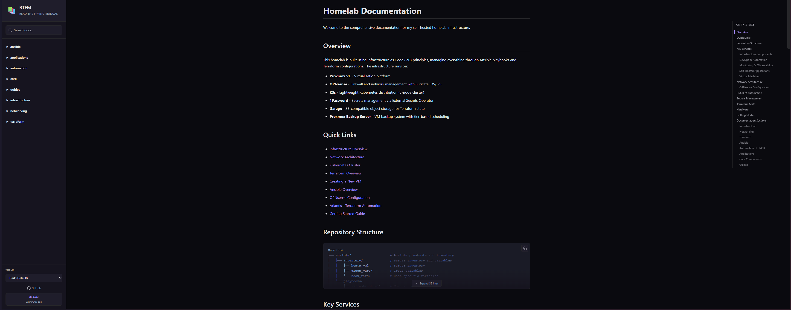

# Read the F***ing Manual

Self-hosted documentation server for homelabs. Serves markdown files from Git with search, syntax highlighting, and a clean interface.



## Why This Exists

Managing homelab documentation is a pain. MkDocs requires build steps and static site generation. Wiki platforms need databases and constant maintenance. I wanted something simpler: point it at a Git repo containing markdown files and get a searchable documentation site with zero configuration.

## Features

- **Git-backed** - Docs live in version control, restart container to pull latest changes
- **14 Themes** - Dark, Light, Catppuccin, Nord, Dracula, Monokai, Solarized, and more
- **Full-text Search** - Keyboard shortcut (Ctrl+K) to search across all documentation
- **Syntax Highlighting** - 15+ languages with copy buttons, language badges, and auto-detection
- **Auto-generated Navigation** - Sidebar builds from your folder structure
- **Mobile Responsive** - Works on phones and tablets
- **Private Repos** - Supports GitHub personal access tokens
- **No Database** - Just markdown files and a Node.js server

## Quick Start

```bash
git clone https://github.com/d1srupt3d/rtfm.git
cd rtfm
cp env.template .env
# Edit .env with your docs repo (or leave blank to use example docs)
docker-compose up -d
```

The `example-docs/` folder contains sample documentation including a [syntax highlighting test page](example-docs/syntax-test.md) showcasing 15+ languages.

## Config

Edit `.env`:

```bash
DOCS_REPO=https://github.com/user/docs.git
DOCS_BRANCH=main
PORT=3000
GITHUB_PAT=ghp_token  # for private repos
```

## Docs Structure

```docs/
├── index.md
├── guides/
│   └── example.md
```

Restart container to pull updates:

```bash
docker-compose restart
```

## Use Cases

- Server configuration and setup procedures
- Troubleshooting runbooks and recovery guides
- Infrastructure-as-code documentation (Ansible, Terraform, Docker stacks)
- Network topology and firewall configurations
- "How did I solve this last time?" reference docs

## Technical Stack

- **Backend**: Node.js 20+ with Express 5
- **Frontend**: Vanilla JavaScript (no framework bloat)
- **Markdown**: marked + gray-matter for frontmatter
- **Syntax**: Highlight.js with 14 theme variants
- **Container**: Single Docker image, minimal footprint

## Development

```bash
npm install
npm run dev
```

## Roadmap

Planned for v0.3.0+:

- Mermaid diagram support for infrastructure diagrams
- Enhanced search with fuzzy matching
- Document templates

## Contributing

PRs and issues welcome. Project is in active development (currently v0.2.0).

## Example Documentation

The `example-docs/` folder contains sample documentation including:
- Welcome page with quick start guide
- [Syntax highlighting test](example-docs/syntax-test.md) showcasing 15+ languages

Use these as templates for your own documentation.

## Credits

Built by [@D1srupt3d](https://github.com/D1srupt3d) using [Cursor](https://cursor.sh)

AI assistance (Claude) was used for:

- Theme system (14 color schemes)
- URL routing fixes (Express 5)
- GitHub Actions workflows
- Search feature
- Syntax highlighting enhancements (v0.2.0)

## License

MIT
