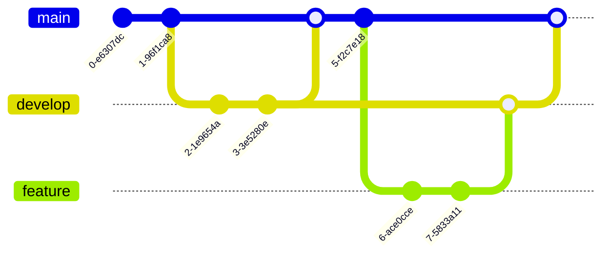

# Mermaid Diagrams

RTFM supports **Mermaid** diagrams for visualizing workflows, architectures, and relationships.

## Flowcharts

Perfect for documenting processes and workflows:

## Sequence Diagrams

Document API interactions and communication flows:

## Infrastructure Diagrams

Visualize your homelab or cloud infrastructure:

## Class Diagrams

Document code structure and relationships:

## State Diagrams

Show system states and transitions:

## Entity Relationship Diagrams

Document database schemas:

## Timeline Diagrams

Document project milestones:

## Gantt Charts

Project planning and task tracking:

## Git Graphs

Visualize branching strategies:

## Usage Tips

1. **Code Block Language**: Use `mermaid` as the language identifier in your code fence
2. **Theme Aware**: Diagrams adapt to your selected theme
3. **Responsive**: Diagrams scale to fit content area
4. **Syntax**: Follow [Mermaid syntax](https://mermaid.js.org/intro/) for diagram types

## Resources

- [Mermaid Documentation](https://mermaid.js.org/)
- [Live Editor](https://mermaid.live/)
- [Syntax Reference](https://mermaid.js.org/intro/syntax-reference.html)
